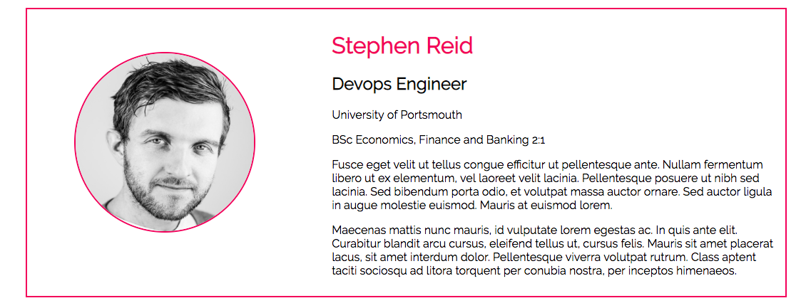
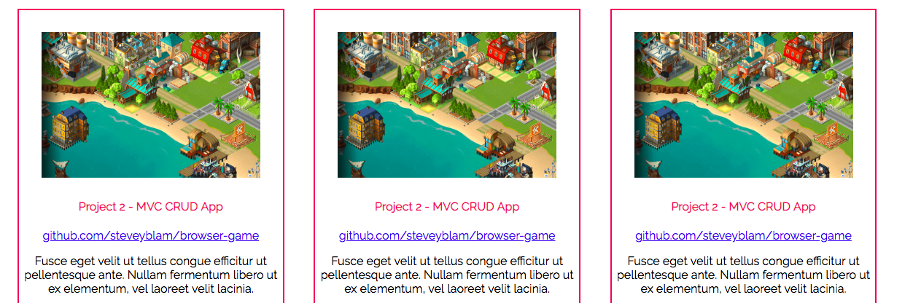
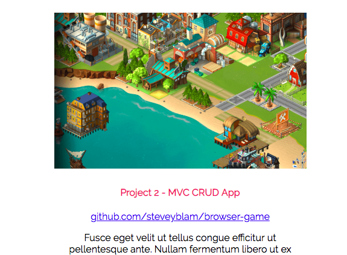

# Media Query Practice

This was an exercise to take an already established site and implement responsive features to it using media queries.

## Changes made

1. The border of the "About me" section was removed. The profile image was also cantered, along with all the text.

2. The logo in the left corner was increased in size when the screen was made smaller

3. On the projects page, when in desktop view, the projects are next to each other. The media query removes the border and the responsive design ensures that the images don't overlap onto the text that is describing them.

